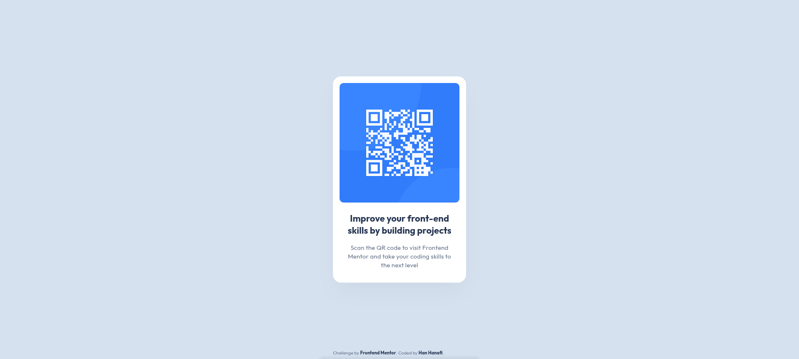

# Frontend Mentor - QR code component solution

This is a solution to the [QR code component challenge on Frontend Mentor](https://www.frontendmentor.io/challenges/qr-code-component-iux_sIO_H). Frontend Mentor challenges help you improve your coding skills by building realistic projects.

## Table of contents

- [Overview](#overview)
  - [Screenshot](#screenshot)
  - [Links](#links)
- [My process](#my-process)
  - [Built with](#built-with)
  - [What I learned](#what-i-learned)
  - [Continued development](#continued-development)
  - [Documentation & Resources](#documentation-and-resources)
- [Author](#author)

## Overview

### Screenshot

Preview :


### Links

- Live Site URL: [QR Code Component](https://haanafii-project.github.io/qr-code-component/)

## Project Structure

```text
QR-CODE-COMPONENT/
├── images/                  # Contains all project graphics and asset images
│   ├── screenshots/         # Storage for project preview screenshots
│   ├── favicon-32x32.png    # Browser tab icon asset
│   └── image-qr-code.png    # The main QR code component image
├── .gitignore               # Specifies intentionally untracked files to ignore
├── AGENTS.md                # Instructions and guidelines for AI coding assistants
├── index.html               # Main HTML document (Application entry point)
├── preview.jpg              # Original design preview for the challenge
├── README.md                # Project documentation and summary
├── style-guide.md           # Design specifications (colors, typography, etc.)
└── style.css                # Main stylesheet for layout and component styling
```

## My process

### Built with

- Semantic HTML5 markup
- CSS custom properties (Variables)
- Flexbox layout
- Mobile-first approach
- Accessible typography (`rem` scaling)
- CSS Logical Properties (`margin-block`, `padding-inline`)

### What I learned

During this project, I learned the importance of scaling layout styles for accessibility instead of using raw pixel units. By converting the style guide's raw parameters into accessible units, the card handles system-wide font zooming cleanly without breaking.

For instance, converting a standard 15px paragraph constraint dynamically:

```css
:root {
  --fs-paragraph: 15px;
}
```

I also learned how to use modern CSS logical properties for better layout flow control:

```css
.card-title {
  margin-block-end: 16px; /* Modern, clean alternative to physical margin-bottom */
}
```

### Continued development

In future projects, I plan to continue practicing:

- Deepening my understanding of WCAG accessibility requirements.
- Exploring responsive layouts using CSS Grid alongside Flexbox.
- Mastering fluid typography rules using clamp().

### Documentation and Resources

I do not use AI; I only read the HTML and CSS documentation.

#

### Author

- Frontend Mentor - @Haanafii_project
- GitHub - @Haanafii_project
